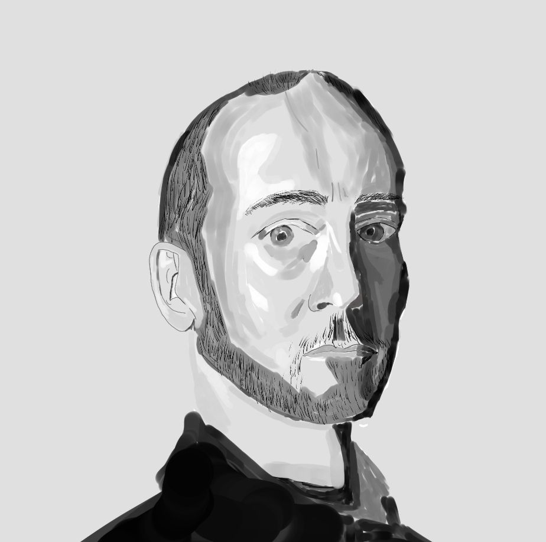

Most artists I know got their start doodling in grade school. I, however, rarely drew as a child, I started much later, during the summer of my junior year in college. I had been thinking about Bertrand Russell's metaphysical argument[^russell] that underlying reality is different from perceived reality as we can perceive the same object in many different ways (that is a table looks different under different lighting and at different angles). It feels so unintuitive that we could go through life unaware of the post-processing our subconsciousness does to stitch together "objects" for us. I wanted to become more aware of this phenomenon, and it seemed that drawing requires being able to understand this divide between objects and perception, so I decided to get my own set of 'artist eyes'

My goal was to draw well enough that I would be impressed by how good the product looked (I didn't know at the time that this was a moving goalpost). Now I wasn't starting completely from scratch. When I was in elementary school my bus driver had weekly art competitions, anyone who entered would get a candy. They always centered on a theme, usually an animal, so every week I'd follow one of those "learn to draw pandas in 45 minutes" tutorials and painstakingly follow ever stroke on my own paper. So naturally I figured with that amount of experience I'd be rivaling Picasso shortly. 

<figure>

<figcaption>A tree I drew from memory.</figcaption>
</figure>

Yeah it didn't really work out. So I asked my artist friends what I was doing wrong and they said to use a reference. I had initially avoided references as it felt like a cop out, how would copying something help me understand reality[^reference]? But I conceded that my knowledge of art was inferior to theirs so I followed their advice.

<figure>

<figcaption>Drawing Asa referencing <a href="https://x.com/inoitoh">inoitoh's</a> work. I didn't use a tree reference because they always come with large quantities of details and complex backgrounds that I didn't want to invest the time into recreating.</figcaption>
</figure>

You might not be able to tell but that's supposed to be Asa from the manga Chainsaw Man[^CSM]. Clearly I was doing something else wrong. So I admitted that Picasso might have actually taken some training to get that good and I got one of my friends to actually join me in person and tutor me. Their first instruction was to draw the basic shapes before the details. I was skeptical, for the longest time I had thought mannequinization was something artists did to look cool. If you've ever seen those art time-lapses the artist will draw some random shapes on a piece of paper and then draw something completely different over the shapes. I had figured that if they were just going to ignore the shapes why even bother putting them on the page? It looked like satire to me. It turns out, the shapes are actually pretty important and after much back and forth I finally agreed to try using them, and to my disappointment it worked.

<figure>

<figcaption>Slightly better drawing of Asa using shapes in the first sketch. Shout-out to IbispaintX for checking in on my mental health after seeing me struggle to draw. </figcaption>
</figure>

At this point my friend goes on a long rant about how artists should start from the basics with drawing simple shapes to build a solid foundation. Although that sounded about as fun as banging my head against a desk I decided I was done being proven wrong. So I started grinding. 

<figure>

<figcaption>Training figure proportions.</figcaption>
</figure>

<figure>

<figcaption>Training quick posing and drawing heads.</figcaption>
</figure>

<figure>

<figcaption>Practicing blocking with random objects.</figcaption>
</figure>

There was also quite a bit of off-screen practice, for example I drew hundreds of boxes at different angles on random sticky notes I had lying around, practiced hand drawing (I now get why so many people draw hands as nubs), feet drawing (I was a bit afraid of getting too good at this though as there is a certain limit at which it becomes suspicious to be good at drawing feet), and face drawing. At this point I was feeling pretty good so I decided to take on a major project. My teacher, being obsessed with volcaloid, insisted I draw Miku.

<figure>
  <video controls playsinline preload="none" width="474" height="1024" style="width: 100%; height: auto; aspect-ratio: 474 / 1024;">
    <source src="/videos/miku_timelapse.mp4" type="video/mp4">
    Your browser does not support video playback.
  </video>
  <figcaption>This was also the first drawing where I did color blocking! Referencing <a href="https://www.pinterest.com/pin/hatsune-miku-anime-idol-vocaloid-miku-miku-hatsune-vocaloid-fanart-vocaloid-miku-expo-in-2025--440367669834440241/">this</a> Pinterest post, I couldn't find the original artist. </figcaption>
</figure>

This was the first piece of art I have ever created where I had a hard time believing I had made it. I finally felt like I had crossed that invisible line where I could call myself an artist, say I draw as a hobby, and -in the great artist tradition- humble brag by saying "I'm so bad at art". Finally to prove that I could also draw realism I did a portrait.

<figure>

<figcaption>I actually followed a portrait drawing tutorial for this one that I unfortunately can't find and credit. The reference was a picture of a somewhat famous artist whose name I can't remember either.</figcaption>
</figure>

In the process of drawing it I realized just how much dynamism colors add to drawing. So I decided that the last thing I needed to learn was colors.

<figure>

<figcaption>Note the pinks and blue undertones on the apple. I wasn't referencing a rotting apple but trying to communicate the lights and darks of the apple through fictional lighting.</figcaption>
</figure>

It didn't come out very pastel when I intended it to be extremely vibrant. So just as in the beginning I turned to a reference by a professional artist so I could learn their techniques.

<figure>

<figcaption>Referencing <a href="https://claguefineart.com/products/fissures-of-fire-1"> Adam Clague's work</a>. Note the subsurface scattering and how the blues, greens, and purples pull the white rinds. Somewhat amusingly I forgot that they were supposed to all be oranges and I made the back right one a grapefruit.</figcaption>
</figure>

I was very happy with the outcome, but, because I had referenced someone else's art it wasn't original. I wanted to do another fruit study, but due to life events I had neither the motivation nor time to draw for the next six months.

[^russell]: Or at least my memory of it from his book "Skeptical Essays".

[^reference]: I didn't realize this at the time but I essentially made the stochastic parrot argument for myself. As it turns out it's helpful, even to humans, to pre-train on existing objects before generalizing to novel concepts. 

[^CSM]: This was just about when arc 2 was wrapping up and all my friends had been talking about it so I decided to draw from it.
