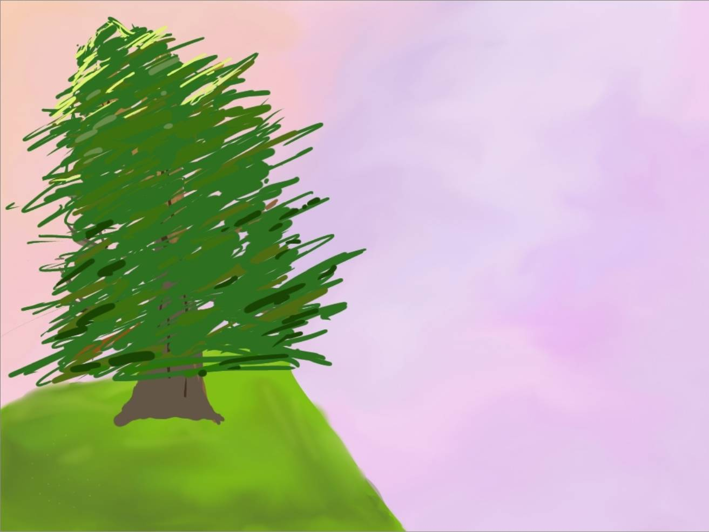
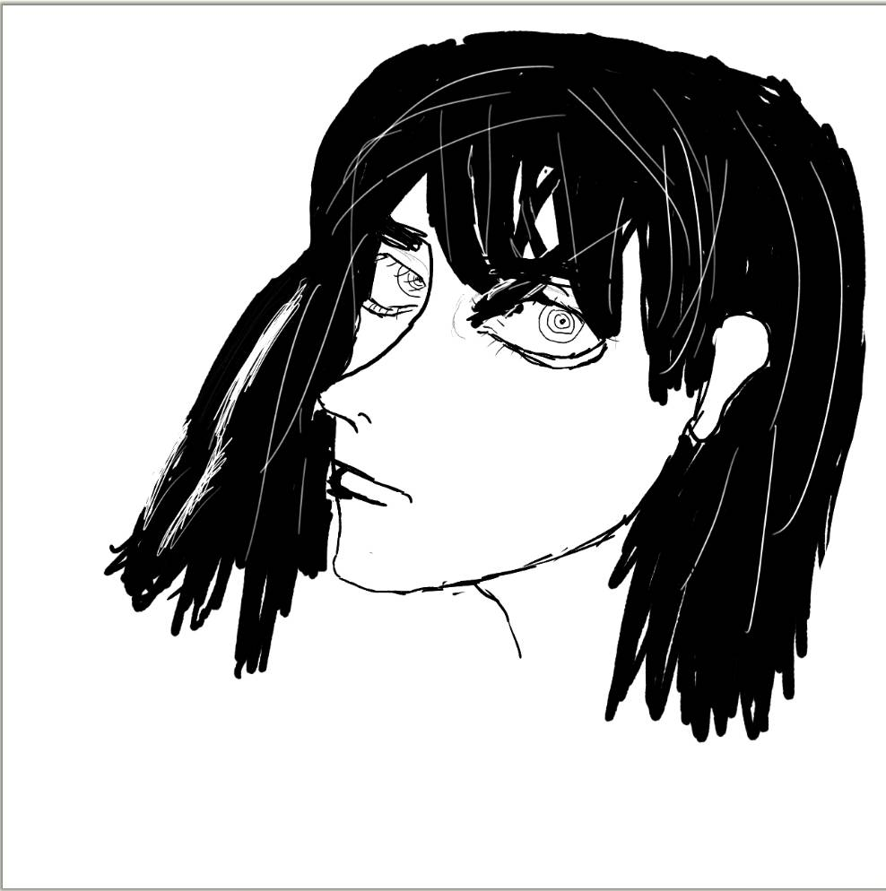
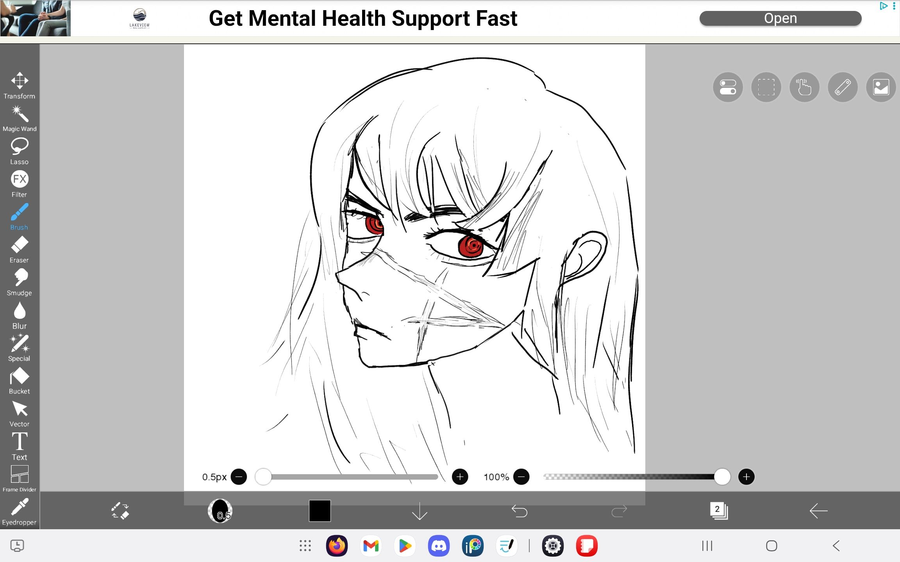
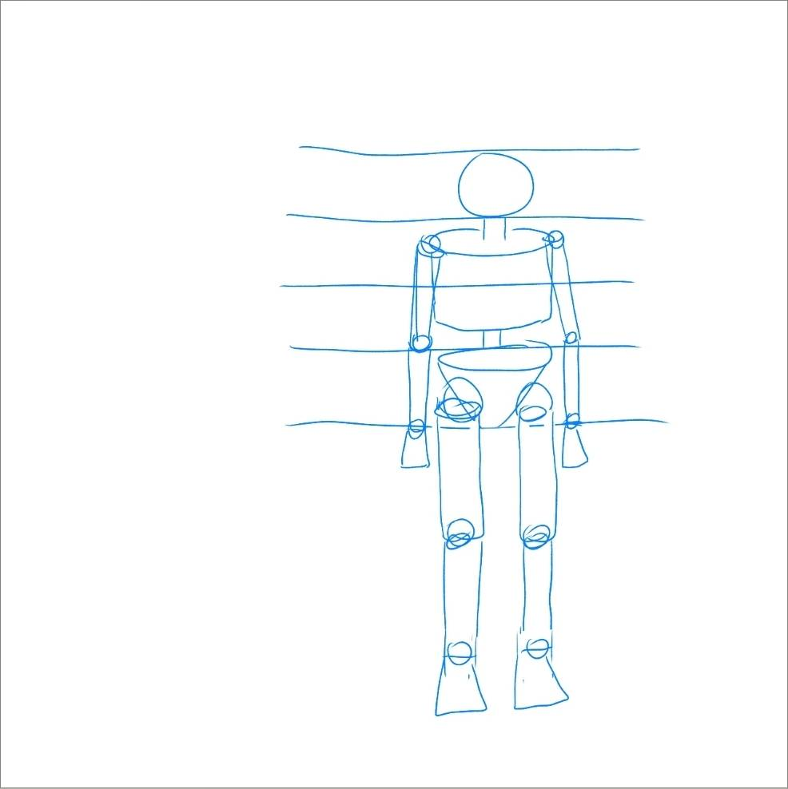
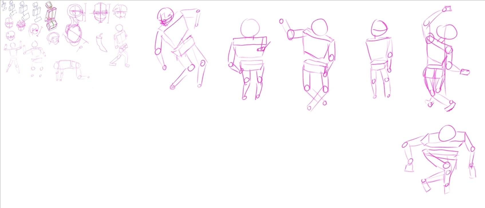
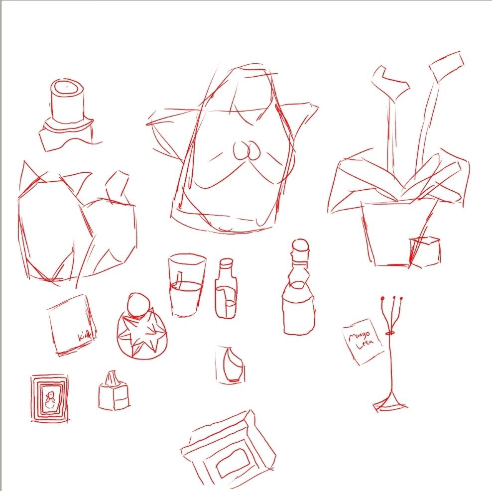
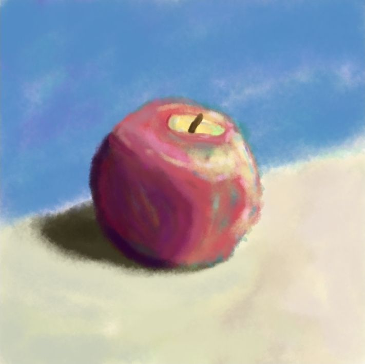
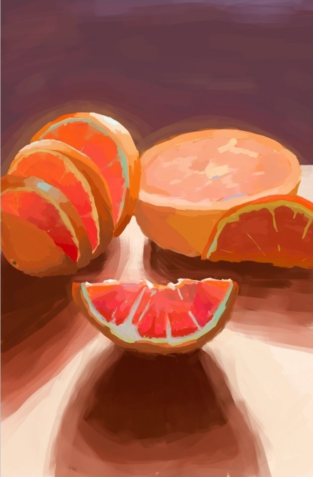

Most artists I know got their start doodling in class. I rarely drew as a child, I started much later, during the summer of my junior year in college. I had been thinking about Bertrand Russell's metaphysical argument [^russell] that underlying reality is different from perceived reality as we can perceive the same object in many different ways (that is a table looks different under different lighting and at different angles). It seemed odd to me that we could go through life unaware of the strange post-processing that our subconsciousness does to stitch together "objects" for us. So I decided that I would learn to draw so that I could directly experience the gap between perception and reality. 

My goal for myself was to be able to draw well enough that I would be impressed by how good it looked (I didn't know at the time that this was a moving goalpost). Now I wasn't starting completely from scratch. When I was in elementary school my bus driver had weekly art competitions, anyone who entered would get a candy. They always centered on a theme, usually an animal, so every week I'd follow one of those "learn to draw pandas in 45 minutes" tutorials and use colored pencils to fill it in. So naturally I figured with that amount of experience I'd be rivaling Picasso shortly. 

<figure>

<figcaption>A tree I drew from memory.</figcaption>
</figure>

Yeah it didn't really work out. So I asked my artist friends what I was doing wrong and they said to use a reference. And I did.

<figure>

<figcaption>Drawing Asa referencing <a href="https://x.com/inoitoh">inoitoh's</a> work</figcaption>
</figure>

You might not be able to tell but that's supposed to be Asa from the manga Chainsaw Man [^CSM]. Clearly I was doing something else wrong. So I got one of my friends to actually join me in person and draw with me. For the longest time I had thought mannequinization was something artists did to look cool. If you've ever seen those art time-lapses the artist will draw some random shapes on a piece of paper and then draw something completely different over the shapes. I had figured that if they were just going to ignore the shapes why even bother putting them on the page? Turns out the shapes were actually useful and they allowed me to improve my drawing.

<figure>

<figcaption>Slightly better drawing of Asa. Shoutout to IbispaintX for checking in on my mental health after seeing me struggle to draw. </figcaption>
</figure>

At this point my friend goes on a long rant about how artists should start from the basics with realism to build a solid foundation. So I start grinding.

<figure>

<figcaption>Training figure proportions.</figcaption>
</figure>

<figure>

<figcaption>Training quick posing and drawing heads.</figcaption>
</figure>

<figure>

<figcaption>Practicing blocking with random objects.</figcaption>
</figure>

There was also quite a bit of off-screen practice, for example I drew hundreds of boxes at different angles on random sticky notes I had lying around. At this point I was feeling pretty good so I decided to take on a major project. So at the suggestion of my friend (who at this point was my art teacher) I found a Miku reference and drew her:

<figure>
  <video controls playsinline preload="none" width="474" height="1024" style="width: 100%; height: auto; aspect-ratio: 474 / 1024;">
    <source src="/videos/miku_timelapse.mp4" type="video/mp4">
    Your browser does not support video playback.
  </video>
  <figcaption>This was also the first drawing where I did color blocking! Referencing <a href="https://www.pinterest.com/pin/hatsune-miku-anime-idol-vocaloid-miku-miku-hatsune-vocaloid-fanart-vocaloid-miku-expo-in-2025--440367669834440241/">this</a> Pinterest post, I couldn't find the original artist. </figcaption>
</figure>

At this point I was feeling pretty confident in my line art and to some extent my poses. So I decided that the last thing I needed to do was get better at colors.

<figure>

<figcaption>Note the pinks and blues in the glare on the apple.</figcaption>
</figure>

It didn't come out nearly how I wanted so instead I referenced a professional drawing so I could see how they use colors.

<figure>

<figcaption>Referencing <a href="https://claguefineart.com/products/fissures-of-fire-1"> Adam Clague's work</a>. Note the subsurface scattering and how the blues and greens pulls the white rinds. Somewhat amusingly I forgot that they were supposed to all be oranges and I made the back right one a grapefruit.</figcaption>
</figure>

At this point I was pretty satisfied with my progress and due to life events I took a 6-month hiatus from drawing.

[^russell]: Or at least my memory of it from his book "Skeptical Essays".

[^CSM]: This was just about when arc 2 was wrapping up and all my friends had been talking about it so I decided to draw from it.
